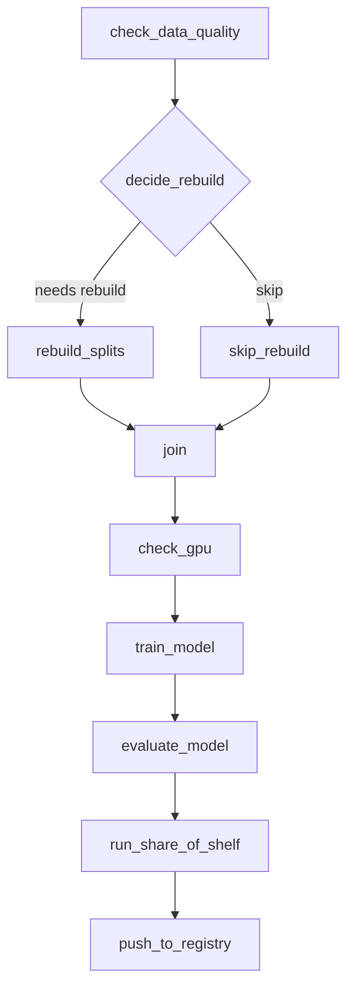

# Retail Object Detection Pipeline

End-to-end retail object detection pipeline for two noodle shelf classes:

- `foodie_noodles_olympics`
- `mr_noodles_competitor`

The project covers data checks, stratified YOLO split rebuilding, Airflow training, YOLO to ONNX export, FastAPI inference, Streamlit upload UI, MySQL prediction logging, Prometheus metrics, and Grafana dashboards.

## Current Model

The serving app uses the exported ONNX model:

```text
runs/train/pipeline_run/weights/best.onnx
```

The FastAPI compose stack mounts it into the container as:

```text
/models/model.onnx
```

Latest test evaluation on the stratified test split:

| Class | Precision | Recall | mAP50 | mAP50-95 |
| --- | ---: | ---: | ---: | ---: |
| foodie_noodles_olympics | 0.939 | 0.991 | 0.993 | 0.788 |
| mr_noodles_competitor | 0.920 | 0.934 | 0.973 | 0.752 |
| all | 0.929 | 0.962 | 0.983 | 0.770 |

## Setup

Copy the environment template before starting Airflow:

```powershell
copy .env.example .env
```

For this dataset, the important app settings are:

```env
APP_DATASET_YAML=dataset/dataset_yolo-20260523T151551Z-3-001/dataset_yolo/data.yaml
APP_SOURCE_DATASET_DIR=dataset/dataset_yolo-20260523T151551Z-3-001/dataset_yolo
APP_STRATIFIED_YAML=dataset/dataset_stratified/data.yaml
APP_STRATIFIED_OUTPUT_DIR=dataset/dataset_stratified
APP_EXPECTED_CLASSES=2
APP_TRAIN_BATCH=4
APP_TRAIN_WORKERS=0
APP_TRAIN_RESUME=true
APP_TRAIN_AMP=true
APP_TRAIN_PATIENCE=0
```

On Windows, do not use `sudo`. Run Docker commands directly from PowerShell.

## Data Utilities

Run diagnostics on the configured stratified split:

```powershell
python diagnose.py
```

Rebuild the stratified train/validation/test split:

```powershell
python rebuild_splits.py
```

The rebuilt split is written to:

```text
dataset/dataset_stratified/
```

with YOLO config:

```text
dataset/dataset_stratified/data.yaml
```

## Airflow Training

Start the Airflow stack from the repository root:

```powershell
docker compose up -d
```

Airflow UI:

```text
http://localhost:8080
```

Default login:

```text
airflow / airflow
```

Primary DAG:

```text
branch_dag
```

High-level flow:



Training writes artifacts under:

```text
runs/train/pipeline_run/
```

Important files:

```text
runs/train/pipeline_run/weights/best.pt
runs/train/pipeline_run/weights/last.pt
runs/train/pipeline_run/weights/best.onnx
runs/train/pipeline_run/results.csv
runs/train/pipeline_run/results.png
```

`best.pt` is updated whenever Ultralytics finds a new best validation fitness. The serving stack uses `best.onnx`, so export ONNX again after a better `best.pt` if needed.

## Evaluate the Best Model

Evaluate the current best model against the stratified test split:

```powershell
python evaluate_best.py
```

This uses:

```text
runs/train/pipeline_run/weights/best.pt
dataset/dataset_stratified/data.yaml
```

## Inference and Monitoring Stack

Start the FastAPI, Streamlit, Prometheus, Grafana, and MySQL stack:

```powershell
docker compose -f fastapi-prometheus-grafana-master\docker-compose.yaml up -d --build
```

Services:

| Service | URL |
| --- | --- |
| FastAPI | http://localhost:8000 |
| API docs | http://localhost:8000/docs |
| Streamlit UI | http://localhost:8501 |
| Prometheus | http://localhost:9090 |
| Grafana | http://localhost:3000 |
| MySQL | localhost:3307 |

Grafana default login comes from `fastapi-prometheus-grafana-master/grafana/config.monitoring`.

## API Usage

Health check:

```powershell
Invoke-RestMethod http://localhost:8000/health
```

Run prediction:

```powershell
curl.exe -X POST -F "image=@dataset/dataset_stratified/test/images/olympic_poc_image_337.jpg" http://localhost:8000/predict
```

List predictions:

```powershell
curl.exe http://localhost:8000/predictions
```

Prometheus metrics:

```powershell
curl.exe http://localhost:8000/metrics
```

## FastAPI Notes

The app reads class names from ONNX metadata. If the model metadata is present, `/health` should show:

```json
{
  "class_names": {
    "0": "foodie_noodles_olympics",
    "1": "mr_noodles_competitor"
  }
}
```

The app also includes a small compatibility migration for older demo MySQL volumes that still contain `human_count` and `car_count`. Those legacy columns are given default `0` values so retail predictions can be saved without resetting the database.

## Troubleshooting

If Docker complains that `.env` is missing:

```powershell
copy .env.example .env
```

If PowerShell says `sudo` is disabled, just remove `sudo`:

```powershell
docker compose up -d
```

If `/predict` returns HTTP 500, check the app logs:

```powershell
docker compose -f fastapi-prometheus-grafana-master\docker-compose.yaml logs --tail=100 app
```

If the FastAPI code changed but the container still behaves the same, rebuild and force-recreate:

```powershell
docker compose -f fastapi-prometheus-grafana-master\docker-compose.yaml up -d --build app
docker compose -f fastapi-prometheus-grafana-master\docker-compose.yaml up -d --force-recreate app
```

## Repository Structure

```text
.
|- dags/
|- src/
|  |- data/
|  |- model/
|  |- pipeline/
|- dataset/
|- runs/
|- fastapi-prometheus-grafana-master/
|  |- app/
|  |- streamlit/
|  |- prometheus/
|  |- grafana/
|- diagnose.py
|- rebuild_splits.py
|- evaluate_best.py
|- docker-compose.yml
|- Dockerfile
|- README.md
```

## Notes

- Keep secrets in `.env`; do not commit real API keys.
- Large datasets and model artifacts should be handled with DVC or external storage.
- The inference container intentionally uses ONNX Runtime instead of PyTorch for a lighter serving image.
